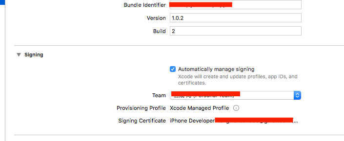
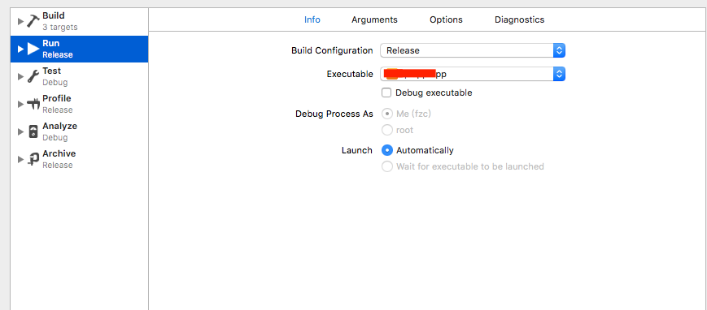

## Xcode无证书打包

写这篇博客的原因是：公司申请了很长时间的苹果企业账号，却久久没有回应，同时又没有苹果个人账号以及公司账号，但app又急着给用户用；无奈之下只好找第三方服务进行企业重签。在没有证书的情况下，我只好打一个自签名的安装包给第三方了；打包的过程遇到一些小坑，因此记录下这次经历，方便于有需要的人！

<!--more-->

#### 1. 在Xcode里登录无证书的开发者账号，然后创建自签名证书


#### 2. 选择刚创建的自签名证书，如果下面出现警告，那么fix issuse即可



#### 3.	在edit scheme中设置run的模式为realese模式



#### 4. run过之后，在finder中全局搜索你的app。(注意如果你的工程名位XXX，那么请搜索XXX.app; 记得选择最近编辑的那个.app文件)


#### 5. 将生成的.app文件转成.ipa文件。
这里就有个坑了，老版本的iTunes直接可以在我的应用程序里将.app文件转换成.ipa文件里；但在新版本的iTunes里费了很大劲怎么也找不到此选项，只好找其他办法来完成此过程。下面推荐一种解压改后缀的方式：

这种方式是在xcode编译产生出.app包的基础上进行进一步处理，通过简单的压缩以及该后缀名即可实现ipa发包。

这种方式下又可通过脚本自动处理以及手动处理两种途径实现，推荐脚本方法，一劳永逸。

##### (1) 脚本自动生成ipa包
Step1: 新建文件夹，命名为“distribute”，新建distribute.sh脚本文件，内容为:

```
// 注意，脚本中所有appName请先替换成你的真正app名称

rm -rf appName
mkdir appName
mkdir appName/Payload
cp -r appName.app appName/Payload/appName.app
cp Icon.png appName/iTunesArtwork
cd appName
zip -r appName.ipa Payload iTunesArtwork

exit 0
```


Step2: 将要转化的.app文件放到distribute/文件夹下
这时的文件夹目录结构是这样的：(注意，脚本中所有appName请先替换成你的真正app名称)

```
distribute/distribute.sh
distribute/appName.app
```

Step3: 运行distribute.sh脚本
打开Terminal，cd到distribute文件夹下，输入`./distribute.sh`。如果提示`permission denied`，则用`chmod 777 distribute.sh`命令赋予权限后，再执行一次`./distribute.sh`。

Step4: 大约若干秒后，会在distribute/文件夹下生成appName/文件夹，里面的appName.ipa就是我们想要的包。

##### (2) 手动压缩改后缀方式
这种方式与上面的方式本质是一样的。

Step1: 新建“Payload”文件夹，注意名字要一字不差；

Step2: 将你的.app包放到Payload中，注意app的名字不做任何更改，就用xcode生成的app名称；

Step3: 在Payload文件夹上右键压缩成zip，然后将生成的.zip文件后缀改成.ipa即可


[参考文章1](http://www.cocoachina.com/ios/20170623/19623.html)

[参考文章2](http://www.cnblogs.com/wengzilin/p/4601684.html)