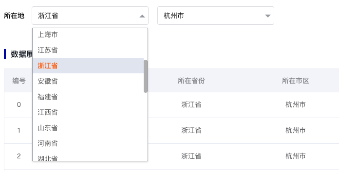
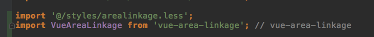
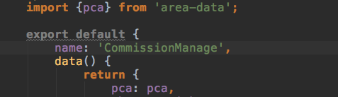
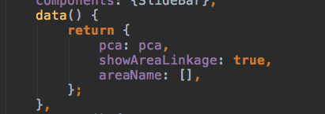
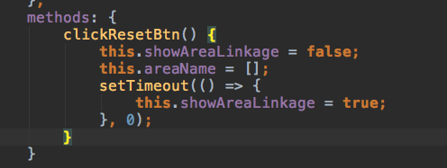

## vue项目里使用vue-area-linkage插件遇到的坑

最近写的项目有一个需求是要写省市区联动选择，上网搜罗了一遍之后发现了`vue-area-linkage`这个插件挺热门的，于是打算开始用这个插件，结果在使用的时候遇到一些坑，于是写下本文来分享下自己的爬坑记。

使用方法作者介绍的很详细了，我就不赘述了[vue-area-linkage 的使用方法](https://github.com/dwqs/vue-area-linkage)。

##### 插件使用之后的样子:

<!--more-->

下面开始介绍遇到的坑以及解决办法：

##### 1.样式问题
我调整这个插件选择框的样式怎么样都无效，去查依赖包中，找到css文件，重新拷贝出来，粘贴到新建个样式文件，引入新建的样式文件，然后开始随便搞事情。

##### 2.运行时出现 `Property or method "pca" is not defined`

结果发现官网表述不清晰，容易造成误解，这个pca文件需要在需要使用该插件的文件中注入：

##### 3.[无法清空之前选择的数据](https://github.com/dwqs/vue-area-linkage/issues/19)
下面开始讲述我的踩坑之路：有个需求是点击重置按钮需要清空之前的选择的数据，但结果怎么样都不能清空，很让人费解啊，无奈之下查源码，找到了对应的方法 `area_cascader_render` , `debugger` 之后，发现在进入页面的时候会渲染一下页面，然后就不会继续渲染了，不渲染，那值自然就是之前的值。

既然找到了产生问题的原因，那就开始解决问题了：

于是想要不在点击事件里把这个值置为空，不好使；那要不控制一下 `placeholder`，不好使；使用jq控制一下 `placeholder` , 不好使，果断放弃。

最后灵机一动那就操作这个组件，点击事件让它先卸载再重新渲染，那样问题不就暂时性解决了嘛？性能问题先不考虑了，先实现功能，于是果断采用v-if。

