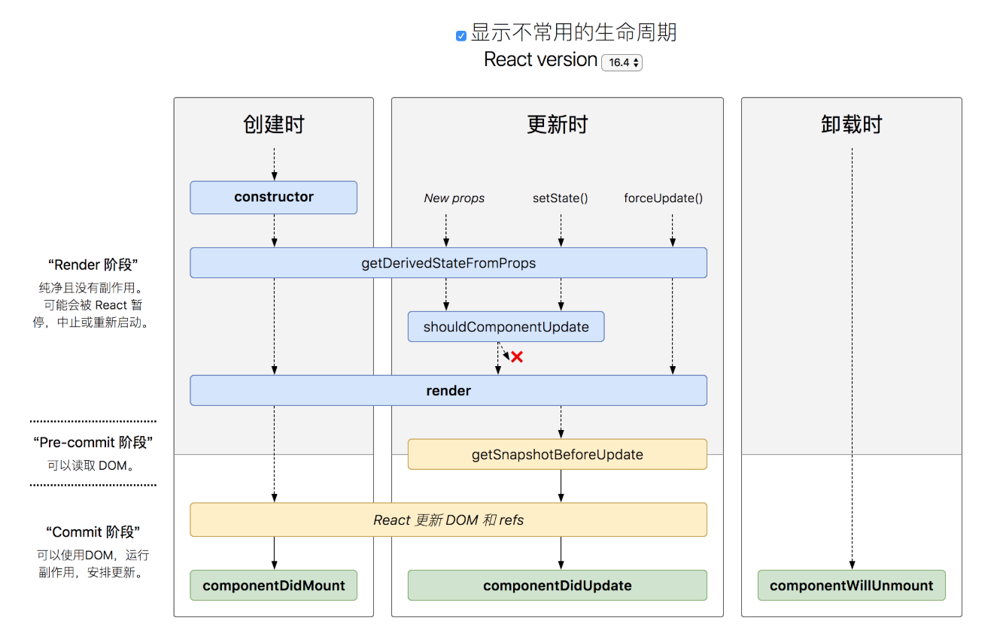

## 浅析 React v16.3 新生命周期函数

#### 生命周期的变化

<!--more-->

#### Fiber 架构
生命周期函数的更改是因为 16.3 采用了 Fiber 架构，在新的 Fiber 架构中，组件的更新分为了两个阶段：

1. render phase：这个阶段决定究竟哪些组件会被更新。
2. commit phase：这个阶段是 React 开始执行更新（比如插入，移动，删除节点）。

commit phase 的执行很快，但是真实 DOM 的更新很慢，所以 React 在更新的时候会暂停再恢复组件的更新以免长时间的阻塞浏览器，这就意味着 render phase 可能会被执行多次（因为有可能被打断再重新执行）。

* `constructor`
* `componentWillMount`
* `componentWillReceiveProps`
* `componentWillUpdate`
* `getDerivedStateFromProps`
* `shouldComponentUpdate`
* `render`
* `setState` updater functions (the first argument)

这些生命周期都属于 render phase，上面已经说了，render phase 可能被多次执行，所以要避免在 render phase 中的生命周期函数中引入副作用。但是 16.3 之前的生命周期很容易引入副作用，所以 16.3 之后引入新的生命周期来限制开发者引入副作用。

#### API 的变化
##### 被拆开的 componentWillReceiveProps
##### getDerivedStateFromProps
react 16.3 新加入的 API，对标的是之前的 componentWillReceiveProps，在一个组件已经实例化后，re-render 之前被调用。这个新的生命周期具有如下特点：

* **无副作用** —— 因为是处于 Fiber 的 render 阶段，所以有可能会被多次执行。所以 API 被设计为了静态函数，无法访问到实例的方法，也没有 ref 来操作 DOM，这就避免了实例方法带来副作用的可能性。但是依旧可以从 props 中获得方法触发副作用，所以在执行可能触发副作用的函数前要三思。
* **只用来更新 state** —— 其实看名字也可以知道，这个生命周期唯一的作用就是从 nextProps 和 prevState 中衍生出一个新的 state。

虽然 getDerivedStateFromProps 对标的是 componentWillReceiveProps，但是 componentWillReceiveProps 作为 16.3 之前的“大杂烩“周期，各种脏活累活都能干。在 16.3 之后 componentWillReceiveProps 要通过 getDerivedStateFromProps 与 componentDidUpdate 合力才能替代。之所以要分拆 componentWillReceiveProps，我个人认为有两方面的原因：

1. Fiber 架构导致组件的更新被随时打断再重来，所以 componentWillReceiveProps 可能会被执行多次，但是无法阻止开发者在 componentWillReceiveProps 中引入副作用（事实上 componentWillReceiveProps 是开发者最喜欢引入副作用的生命周期），所以只能将这个 API 拆成在 render phase 中的纯函数 getDerivedStateFromProps 和在 commit phase 中的 componentDidUpdate 来让组件更好预测和维护。

2. [这篇文章](https://zhuanlan.zhihu.com/p/36062486) 中一针见血得指出：
   > **React 团队试图通过框架级别的 API 来约束或者说帮助开发者写出可维护性更佳的 JavaScript 代码**

   框架最大的特点就是“限制”，通过这么一个限制重重的静态生命周期不让你调用实例方法，就给你 props 和 prevState 让你来 derived state，甚至连这个生命周期的都是一反常态的用一个具体的行为而不是用一个更新过程的时间节点来命名，就是让开发者只做 derived state 这个行为，并且通过返回值来更新 state 可以保证只更新一次 state（以前的 componentWillReceiveProps 是通过  batchUpdate 来保证只更新一次）。

不过官方并不推荐使用 getDerivedStateFromProps，倒不是 getDerivedStateFromProps 这个 API 带来的问题，而是 **derived state** 带来的问题，之前的 componentWillReceiveProps 也有这个问题。

derived state 会造成不只一个 source of truth，我们都知道，React 的哲学是 `view = f(data)`，但是当有两个 data 去表征同一个参数造成 view 的修改时就有麻烦了，所以在使用 getDerivedStateFromProps 之前一定要想好是否可以直接使用 props。

getDerivedStateFromProps 作为一个静态函数是不能访问实例属性的，如果需要通过实例方法和 state 或者 props 来计算一个值在 render 周期中使用的 state，那么最好的方法是直接在 render 中计算出这个值然后直接使用，因为这会是一个纯函数的操作。这从侧面反映出来，这次生命周期的升级通过添加限制在一定程度上规范了生命周期的使用。

##### componentDidUpdate()
那么，之前的副作用在要放在哪里呢？答案就是 componentDidUpdate。

不过这又带来了一个问题，在之前版本的生命周期中，开发者最喜欢使用 componentWillReceiveProps 的一个原因就是 componentWillReceiveProps 不会引起 re-render，而 componentDidUpdate 中 setState，会再次引发一轮的 re-render。

所以我们要尽量避免在 componentDidUpdate 中 setState，而是提前到 getDerivedStateFromProps，将网络操作的副作用放在 componentDidUpdate 中，一方面网络总是有一定延迟的，不管放在哪个生命周期中都会引发 re-render，另一方面是 componentDidUpdate 中 DOM 已经更新。

将通过 props 或 state 计算的衍生数据放在 render 中，一方面符合 render 的纯函数理念，另一方面减少了产生新的 truth of source 的概率。

##### getSnapshotBeforeUpdate()
getSnapshotBeforeUpdate 处于 render phase 和 commit phase 的中间，不过准确的说是处于 commit phase 的阶段，因为它只会被执行一次，在 react 修改 DOM 之前会被紧挨着调用，所以在这个生命周期能够获取这一次更新前的 DOM 的信息。这个生命周期返回的值将作为 componentDidUpdate 的第三个参数。

#### 参考
* [You Probably Don't Need Derived State](https://reactjs.org/blog/2018/06/07/you-probably-dont-need-derived-state.html)
* [How can we fetch data async in reaction to props changes with getDerivedStateFromProps?](https://github.com/reactjs/rfcs/issues/26)
* [Discussion: componentWillReceiveProps vs getDerivedStateFromProps](https://github.com/reactjs/reactjs.org/issues/721)
* [React v16.3 版本新生命周期函数浅析及升级方案](https://zhuanlan.zhihu.com/p/36062486)
* [react-lifecycle-methods-diagram](https://github.com/wojtekmaj/react-lifecycle-methods-diagram)
* [React Fiber架构](https://zhuanlan.zhihu.com/p/37095662)

[尊重原创，感谢分享](https://github.com/fi3ework/blog/issues/37)
